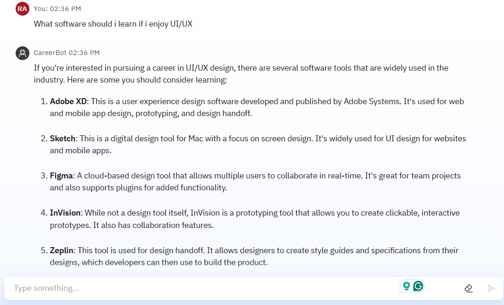
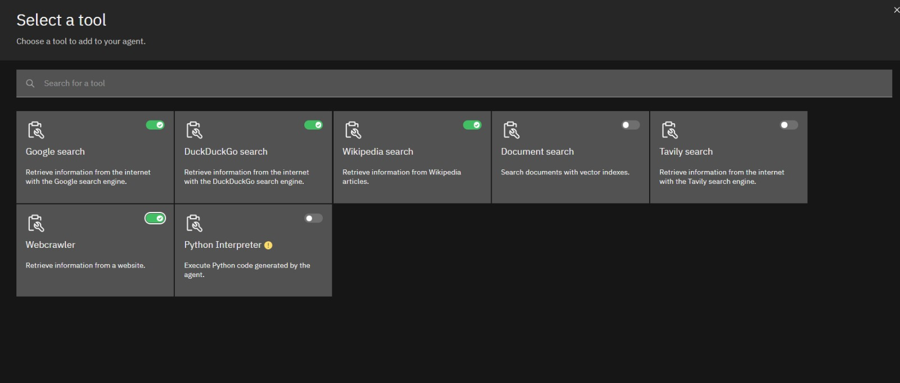

# CareerBot: Agentic AI Career Counseling for IBM SkillsBuild Internship 2025

**CareerBot** is a smart, document-powered AI agent designed to provide personalized career counseling to Indian students. Built using **IBM Watsonx.ai**, **Granite LLM**, and **Vector Indexing (RAG)**, it answers career-related queries grounded in curated documents uploaded by the developer. 

This project was developed as part of the **IBM SkillsBuild for Academia Internship 2025**, showcasing prompt engineering, agentic orchestration, and no-code deployment on IBM Cloud.

---

## What This Repository Contains

This repository contains a setup Jupyter file that documents how the AI agent was created using IBM tools. Inside, you'll find:

- Explanation of the project and technologies used  
- Screenshots of the AI agent in action  
- Key files like agent instructions and learning blocks  
- Final project presentation  
- Quick start questions used for user onboarding

---

## Key Features & WOW Factors

- **Document-Based Q&A:** Trained with real learning documents to give grounded, relevant answers
- **Granite LLM + Watsonx.ai:** Powered by IBM’s top-tier large language model
- **Vector Indexing (RAG):** Answers are pulled directly from curated content using Retrieval-Augmented Generation
- **Indian Student Focused:** Tailored for Indian education systems, job markets, and career paths
- **Polite Redirection:** Handles irrelevant queries gracefully
- **Built Without Writing Code:** Created entirely using IBM Watsonx Studio tools

---

## Screenshots

| Chat Example | Agent Instructions | Tools Setup | API & Deployment |
|:------------:|:------------------:|:-----------:|:----------------:|
|  <br> *CareerBot responding to a real query about AI careers* |  <br> *Core instruction rules for grounded, helpful responses* |  <br> *Tools like Google, Wikipedia, and Python enabled* |  <br> *Public/Private endpoints for inferencing and deployment* |

| Persona Setup | Welcome Panel | IBM Cloud Resources |
|:-------------:|:-------------:|:-------------------:|
|  <br> *Agent’s persona defined as a friendly career assistant* |  <br> *Sample start questions and greeting in the UI* |  <br> *IBM Cloud services like watsonx.ai, Storage used* |

Other visuals:
- Agent Instructions
- Testing Tools
- Quick Start Questions
- Learning Resources

---

## How It Works

1. AI Agent is created in **IBM Watsonx.ai Studio**
2. Custom **instructions and guardrails** are set to limit hallucination
3. Multiple `.txt` learning files are uploaded to the **Vector Index**
4. Agent responds using **Granite LLM + RAG**, ensuring answers are factual and document-backed
5. Students ask queries like:
   - *"What career options are available for a PCM student?"*
   - *"What skills are needed to be a Data Scientist?"*

---

## Technologies Used

- IBM Watsonx.ai Studio
- IBM Granite Foundation Model (LLM)
- Watsonx Vector Index (RAG)
- Prompt Engineering (system & user prompts)
- IBM Cloud Lite (free tier)
- Screenshots and Text Files (for content grounding)

---

## Repository Structure

```
careerbot/
├── screenshots/ # Screenshots of the project
├── prompts/ # Custom instructions given to the agent
├── docs/ # User guide, FAQ, and system overview (optional)
├── learning_blocks/ # Uploaded .txt files used for vector training
├── presentation/ # Final PPT submission for IBM internship
├── README.md # This file
├── LICENSE
```

---

## Project Presentation

Final submission for IBM SkillsBuild:
- [IBM_EduNet_Presentation.pptx](presentation/IBM_Edunet_RishabhAhuja.pptx)
- [IBM_EduNet_Presentation.pdf](presentation/IBM_Edunet_RishabhAhuja.pdf)

---

## Project Purpose

Built to help students in India:
- Explore career paths across STEM and non-STEM fields
- Get suggestions on skills, certifications, and jobs
- Learn about industry trends (2025–2030)
- Access all this **without needing to code or install anything**

---

## License

This project is licensed under the **MIT License**.  
See [LICENSE](LICENSE) for more information.

---

## 🙋 Contact

Feel free to connect:

- GitHub Issues: [CareerBot Issues](https://github.com/rishabhahuja12/careerbot/issues)
- Email: rishabhahuja961@gmail.com
